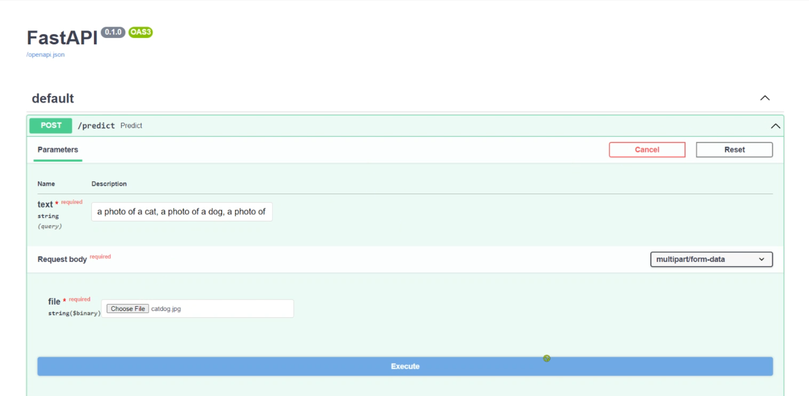
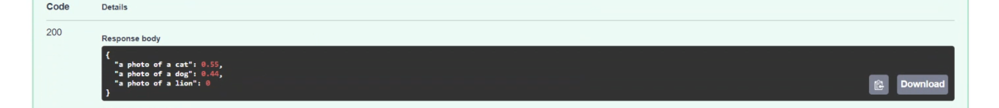

# Deploy CLIP as a service on ECS with Load Balancer 5 replicas
With a given image and a list of texts, model will provide probability of similarity between each text and image.


![fastapi[all]](https://img.shields.io/badge/fastapi[all]-0.98.0-green)


## Features
- CLIP model from Hugging Face
- AWS ECS Deployment
- Load balancing with 5 services
- Locust stress testing
- Docker deployment
- FastAPI

## Dockerize the model
```
1. Clone this github repo inside a project folder

2. Build docker image
docker build --tag clip .

3. Run docker image
docker run -it -p 80:80 clip
```
Model service will be created using fastapi. Now open "localhost:80/docs" to test the model inside fastapi interface.

## Locust stress test
```
1. Install locust library
pip install locust

2. Run locust script to start web UI
locust -f locust_test.py
```
Open localhost:8089 to open interface and start load testing.

For AWS, spin up an EC2 instance and perform below steps:
1. Build docker image inside EC2 instance. 
2. Create an ECR public repository and push your image here.
3. In ECS, create a cluster and a task definition with ALB load balancing option selected during task deployment.
4. Add security groups to your load balancer with all required ports open.
5. Check if all the load balancer target services are healthy, run locust script inside EC2 instance.
6. Open locust interface with url "<instance_ip>:80" in your browser. Use load balancer DNS url inside locust and start the test.

You may scale up number of services/container in your load balancer and see the change in RPS (Requests Per Second) inside locust.

## FastAPI Test
Note: You need to provide multiple texts separated by comma (,) and an image.





## Group Members
- Aman Jaipuria
- Anurag Mittal